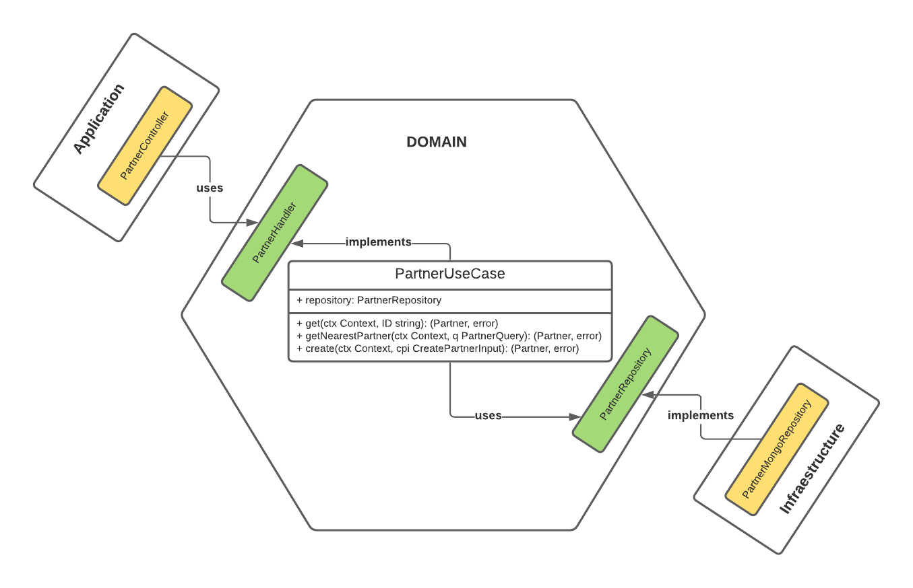

# Partner Service
[](https://circleci.com/gh/Ralphbaer/ze-delivery/?branch=master)

The badge above shows the status of the last pipeline. If everything goes well, the badge will be "green" indicating success or "red" (failed) indicating some error in the build.

This repo contains the source code of the Partner service.

## Architecture



## Requirements

| Name | Version | Notes | Mandatory
|------|---------|---------|---------|
| [golang](https://golang.org/dl/) | >= go1.15.14 | Main programming language | true
| [docker](https://www.docker.com/) | n/a | Used to start local environment providers (MongoDB) | true
| [aws-cli](https://aws.amazon.com/pt/cli/) | v2 | Used to create all AWS Enviroment (Just in case you want to know) | false
| [sh/bash] | depending on OS. Anyway, you should be able do execute any .sh file | Used to lint checks, test processes and some console interface customizations | true
| [make](https://www.gnu.org/software/make/) | depending on OS. Anyway, you should be able do execute make commands to run the project, tests and localenvironment | n/a | true

## Providers

| Name | Version | Notes
|------|---------|---------|
| [aws](https://aws.amazon.com/pt/) | n/a | All the infraestructure are on AWS
| [mongodb](https://www.mongodb.com/) | any stable version | If you want, you can use any mongoDB client to access the local database created | true

# Usage
Inside /partner, follow the steps.:


### GitHub Env
```bash
make setup-env            
```

### Start Local Database
- If you want to just test local without any preload data, just run:
```bash
make localenv            # Start local mongodb empty instance
```

- If you want to preload some test data local, run:
```bash
make localenv-withData            # Start local mongodb with preload data based on .localenv/withData/partners.json
```

PS.: After running any of the commands above, it will start an instance on your machine and the thread used in the command line of your choice will be blocked (cuz docker is running an instance). You need to open a second command line window to run the next command.

I could have let the instance run in the background, but that way you can keep track of the logs in the command line.


### Notes about the preload dataset
Every time you create a new instance using mongo's preload data (make localenv-withData), all the 51 partners of partners.json are created again (ie. they are not being persisted with a preconditioned ID) and mongo will always generate new ids. If you want to get a generated ID, I recommend opening the local instance and choosing which ID you want to test (for Get(ID) cases).

### Finally Start Service
After starting the database locally, you are ready to execute the service. Run: 
```bash
make run            # Start local service on port :3000
```

# Testing

```bash
make test                 # Run all unit tests and integration test
make unit-test            # Run all unit tests
make integration-test     # Run integration test
```
## Documentation

Visit [this link](http://ze-delivery-microservices-elb-6682139.us-east-2.elb.amazonaws.com/partner/docs#overview) for API documentation. If you want to access the docs locally, just change the host in the url to localhost:3000. Something like: http://localhost:3000/partner/docs

# Deploy
The service uses a Circle pipeline that is triggered when a code is pushed to master branch.
The master has no PR approval criteria to facilitate the tests for the Ze Delivery team.
For testing deploy purposes, you guys can change anything in the code or just change the signal.id file inside /partner, commit and push the change to master and wait the circle-ci to deploy the code. :)

All provisioning on the AWS Cloud has already been done and its running.

CircleCi is also working. Maybe you could create an account to access the project there through this link https://app.circleci.com/pipelines/github/Ralphbaer/ze-delivery?invite=true.

If you guys cant get the access, no problem, I can talk calmly and give all the details of both AWS provisioning (ec2, load balancer, system manager, secrets, etc.) and the circleCI pipeline.